# AI Employee Vault - Architecture Diagrams

**Version**: 1.0.0
**Last Updated**: 2026-02-16
**Tier**: Platinum

---

## Table of Contents

1. [System Overview](#system-overview)
2. [Cloud/Local Zone Architecture](#cloudlocal-zone-architecture)
3. [Data Flow Diagrams](#data-flow-diagrams)
4. [Security Boundaries](#security-boundaries)
5. [MCP Integration Map](#mcp-integration-map)
6. [Deployment Architecture](#deployment-architecture)
7. [State Machine](#state-machine)
8. [Component Interactions](#component-interactions)

---

## System Overview

### High-Level Architecture

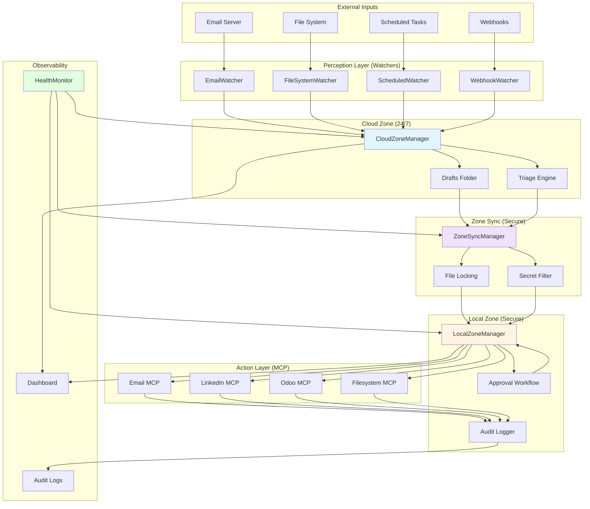

---

## Cloud/Local Zone Architecture

### Zone Specialization

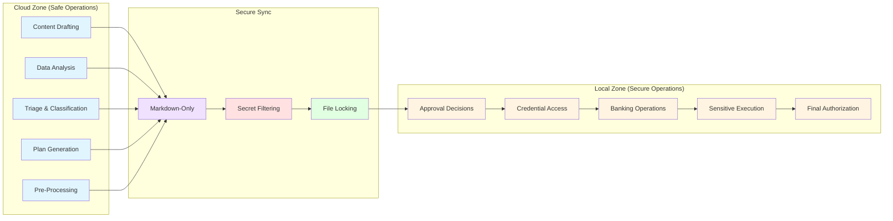

### Zone Communication Flow

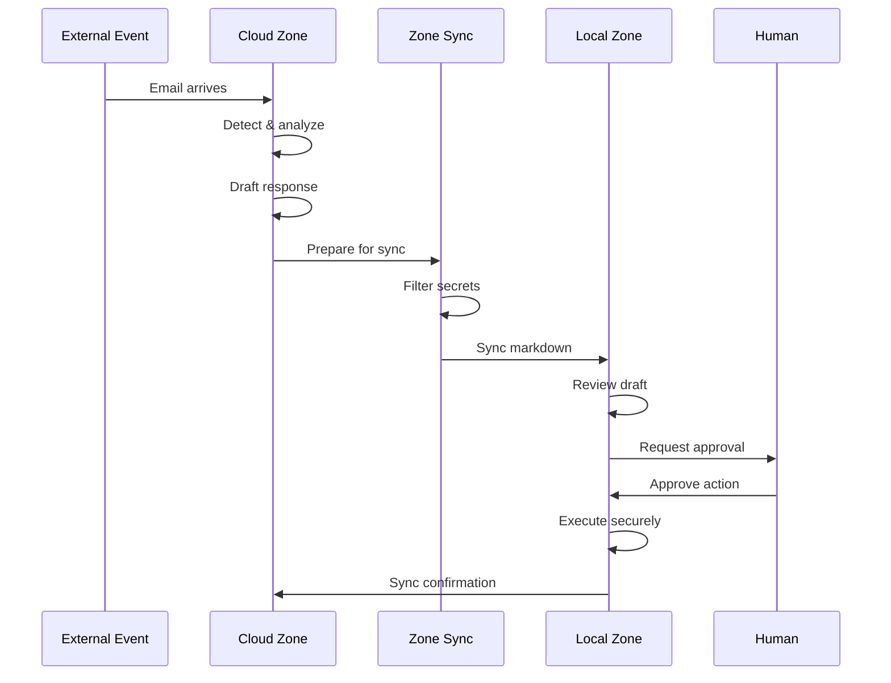

---

## Data Flow Diagrams

### Complete Task Lifecycle

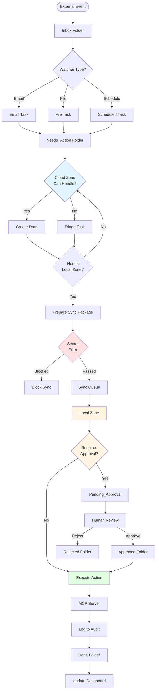

### Email Processing Flow

```mermaid
flowchart LR
    EMAIL([Email Arrives])

    DETECT[EmailWatcher<br/>Detects New Email]
    CREATE[Create Task in Inbox]
    MOVE[Move to Needs_Action]

    ANALYZE[Cloud Zone<br/>Analyzes Content]
    CLASSIFY{Classification}

    DRAFT_RESP[Draft Response]
    SYNC_LZ[Sync to Local Zone]
    REQ_APPROV[Request Approval]

    HUMAN[Human Reviews]
    DECISION{Decision}

    SEND[Send Email via MCP]
    LOG[Log to Audit]
    ARCHIVE[Archive to Done]

    EMAIL --> DETECT
    DETECT --> CREATE
    CREATE --> MOVE
    MOVE --> ANALYZE
    ANALYZE --> CLASSIFY

    CLASSIFY -->|Inquiry| DRAFT_RESP
    CLASSIFY -->|Spam| ARCHIVE
    CLASSIFY -->|Complex| REQ_APPROV

    DRAFT_RESP --> SYNC_LZ
    SYNC_LZ --> REQ_APPROV
    REQ_APPROV --> HUMAN

    HUMAN --> DECISION
    DECISION -->|Approve| SEND
    DECISION -->|Reject| ARCHIVE

    SEND --> LOG
    LOG --> ARCHIVE

    style ANALYZE fill:#e1f5ff
    style SYNC_LZ fill:#f0e1ff
    style REQ_APPROV fill:#fff4e1
    style HUMAN fill:#ffe1f0
```

---

## Security Boundaries

### Security Zones

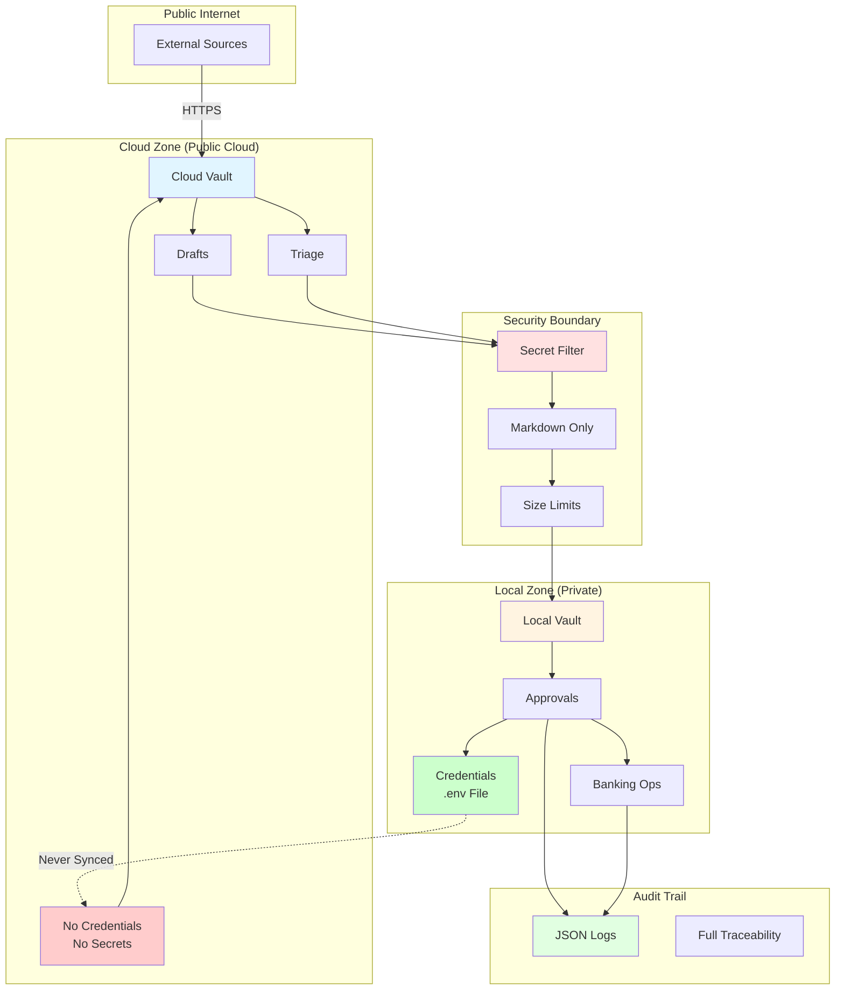

### Approval Thresholds

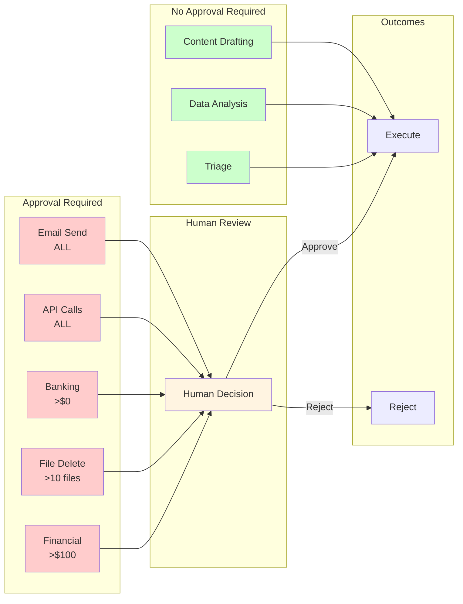

---

## MCP Integration Map

### MCP Server Architecture

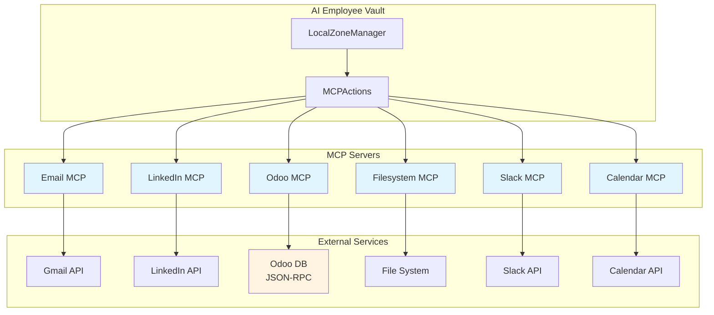

### MCP Action Flow

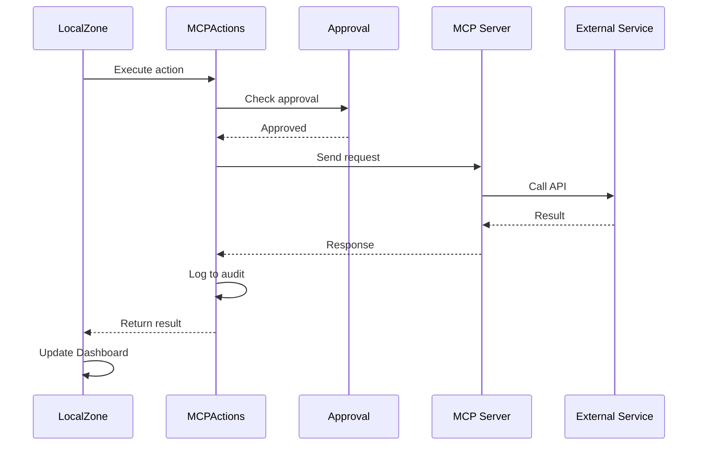

---

## Deployment Architecture

### Production Deployment

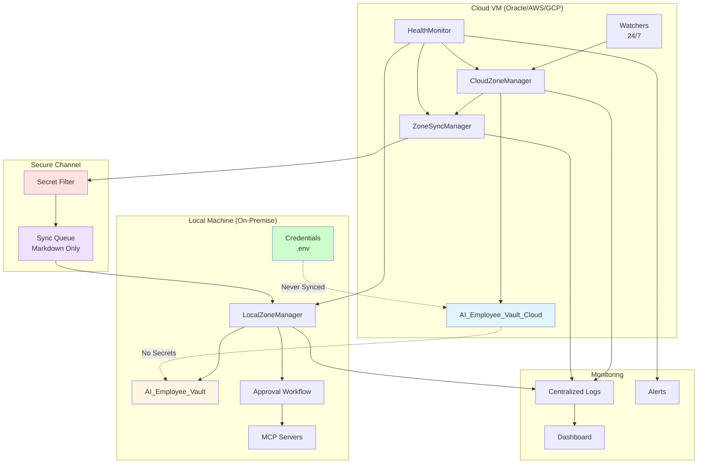

### Development/Simulation Mode

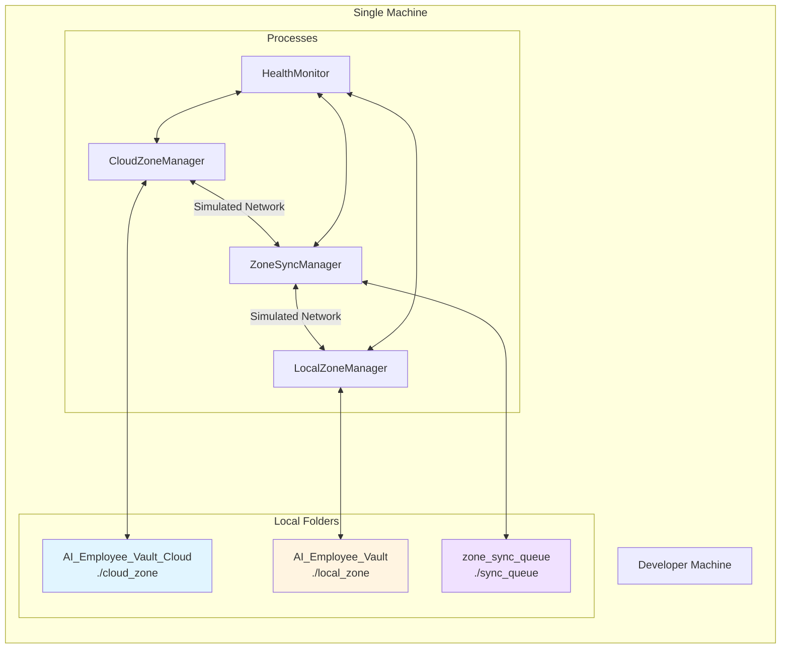

---

## State Machine

### Task State Transitions

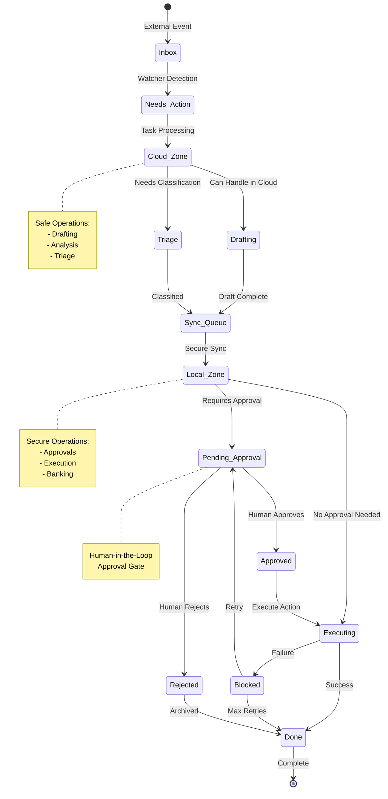

---

## Component Interactions

### Claim-by-Move Delegation

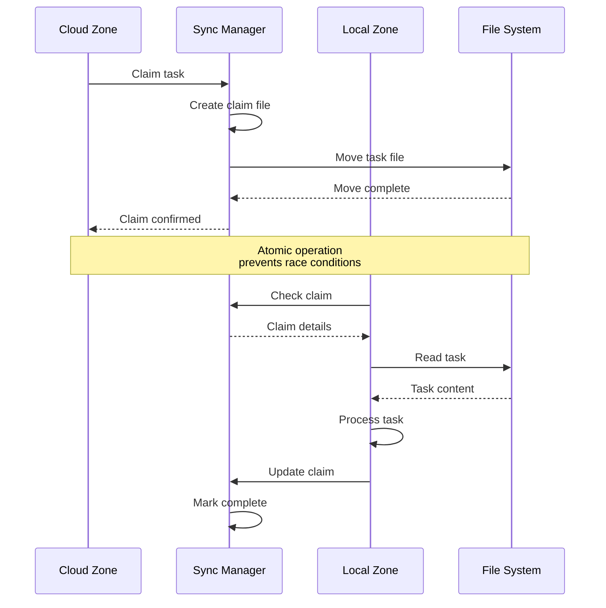

### Single-Writer Dashboard

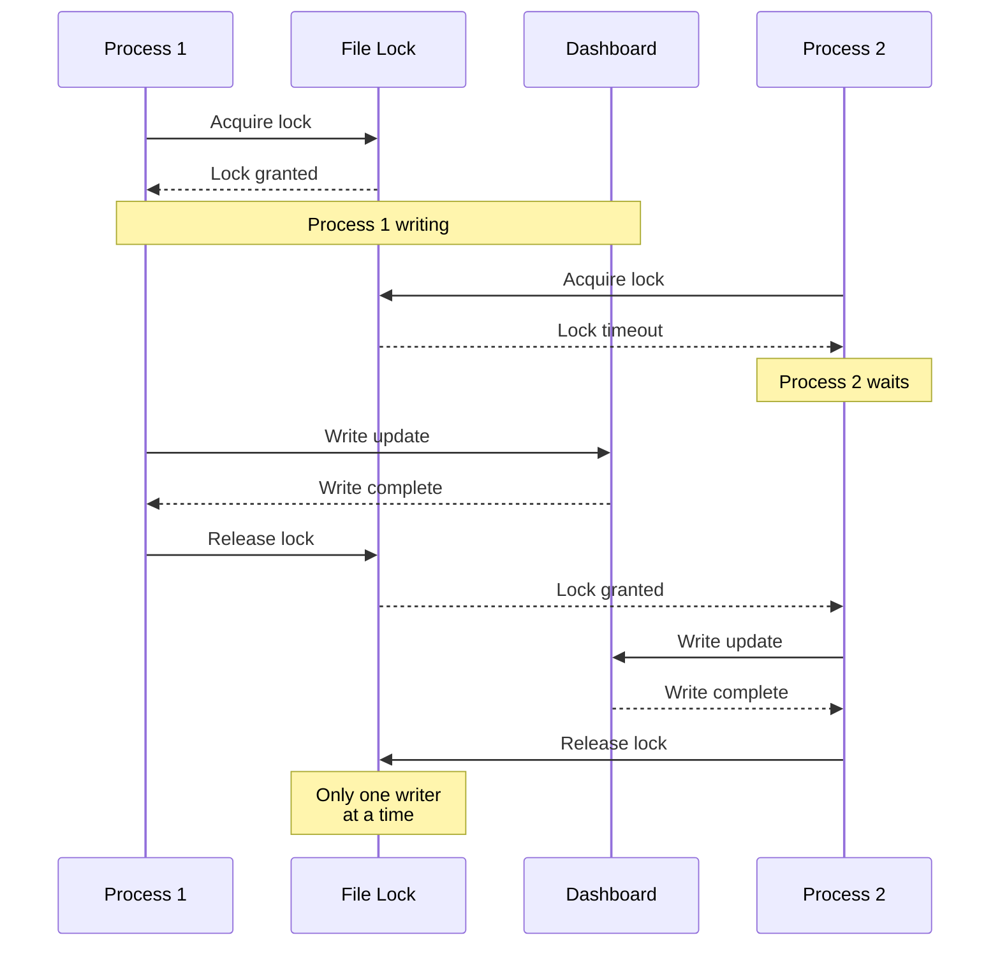

### Health Monitoring Loop

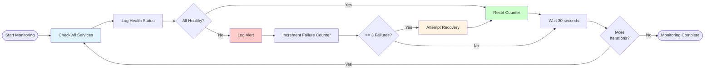

---

## ASCII Diagrams

### System Overview (ASCII)

```
┌─────────────────────────────────────────────────────────────────────────┐
│                         AI EMPLOYEE VAULT                               │
│                         Platinum Tier Architecture                     │
└─────────────────────────────────────────────────────────────────────────┘

┌──────────────┐      ┌──────────────┐      ┌──────────────┐
│  EXTERNAL    │      │  CLOUD ZONE  │      │  LOCAL ZONE  │
│   INPUTS     │──────│   (24/7)     │──────│   (Secure)   │
├──────────────┤      ├──────────────┤      ├──────────────┤
│ • Email      │      │ • Drafting   │      │ • Approvals  │
│ • Files      │      │ • Analysis   │      │ • Banking    │
│ • Schedule   │      │ • Triage     │      │ • Execution  │
│ • Webhooks   │      │ • Planning   │      │ • Credentials│
└──────────────┘      └──────────────┘      └──────────────┘
                            │                      │
                            │      ┌───────┐       │
                            └──────│  SYNC │───────┘
                                   │ QUEUE │
                            ┌──────│       │───────┐
                            │      └───────┘       │
                      ┌─────┴─────┐         ┌─────┴─────┐
                      │  SECRET   │         │   FILE    │
                      │  FILTER   │         │   LOCK    │
                      └───────────┘         └───────────┘

                            │
                            ▼
┌─────────────────────────────────────────────────────────────────────────┐
│                         MCP INTEGRATIONS                                │
├──────────────┬──────────────┬──────────────┬──────────────┬─────────────┤
│   Email      │  LinkedIn    │    Odoo      │  Filesystem  │   Slack     │
│   MCP        │     MCP      │     MCP      │     MCP      │    MCP      │
└──────────────┴──────────────┴──────────────┴──────────────┴─────────────┘
                            │
                            ▼
┌─────────────────────────────────────────────────────────────────────────┐
│                      OBSERVABILITY & LOGGING                            │
├─────────────────────────────────────────────────────────────────────────┤
│  • Health Monitor  • Audit Logs  • Dashboard  • Alerts                  │
└─────────────────────────────────────────────────────────────────────────┘
```

### Security Zones (ASCII)

```
┌─────────────────────────────────────────────────────────────────────────┐
│                        SECURITY ARCHITECTURE                            │
└─────────────────────────────────────────────────────────────────────────┘

┌──────────────────────┐
│   PUBLIC INTERNET    │
└──────────┬───────────┘
           │ HTTPS
           ▼
┌──────────────────────┐
│     CLOUD ZONE       │  ◄── Safe Operations Only
│  ┌────────────────┐  │      • Drafting
│  │  Cloud Vault   │  │      • Analysis
│  │                │  │      • Triage
│  │  • Drafts      │  │      • Planning
│  │  • Triage      │  │
│  │  • Plans       │  │  ❌ NO CREDENTIALS
│  └────────────────┘  │  ❌ NO SECRETS
└──────────┬───────────┘
           │
           │    ┌─────────────────┐
           └───►│  SECURITY BOUNDARY│
                │  ┌─────────────┐ │
                │  │Secret Filter│ │
                │  │Markdown Only│ │
                │  │Size Limits  │ │
                │  └─────────────┘ │
                └────────┬─────────┘
                         │
                         ▼
┌──────────────────────┐
│     LOCAL ZONE       │  ◄── Secure Operations
│  ┌────────────────┐  │      • Approvals
│  │  Local Vault   │  │      • Execution
│  │                │  │      • Banking
│  │  • Approvals   │  │      • Credentials
│  │  • Done        │  │
│  │  • Audit       │  │  ✓ CREDENTIALS
│  └────────────────┘  │  ✓ SECRETS
│  ┌────────────────┐  │     (.env file)
│  │ Credentials    │  │
│  │    (.env)      │  │
│  └────────────────┘  │
└──────────┬───────────┘
           │
           ▼
┌──────────────────────┐
│     AUDIT TRAIL      │
│  • JSON Logs         │
│  • Full Traceability │
└──────────────────────┘
```

### Data Flow (ASCII)

```
┌──────────────────────────────────────────────────────────────────────────┐
│                       TASK LIFECYCLE FLOW                               │
└──────────────────────────────────────────────────────────────────────────┘

  ┌─────────┐     ┌──────────┐     ┌─────────────┐     ┌───────────┐
  │ EXTERNAL│ ──► │  INBOX   │ ──► │ NEEDS_ACTION│ ──► │ CLOUD     │
  │  EVENT  │     │          │     │             │     │  ZONE     │
  └─────────┘     └──────────┘     └─────────────┘     └───────────┘
                                                          │
                                    ┌─────────────────────┤
                                    │                     ▼
                                    │              ┌─────────────┐
                                    │              │   DRAFTING  │
                                    │              │             │
                                    │              │  • Triage   │
                                    │              │  • Draft    │
                                    │              │  • Analyze  │
                                    │              └─────────────┘
                                    │                     │
                                    │              ┌─────────────┐
                                    └─────────────►│   SYNC      │
                                                   │  Queue      │
                                                   └─────────────┘
                                                         │
                                                         ▼
                                                   ┌─────────────┐
                                                   │   SECRET    │
                                                   │   FILTER    │
                                                   └─────────────┘
                                                         │
                                                ┌────────┴────────┐
                                                │                 │
                                          BLOCKED│                 │PASSED
                                                │                 ▼
                                                │          ┌─────────────┐
                                                │          │  LOCAL      │
                                                │          │  ZONE       │
                                                │          │             │
                                                │          │  • Review   │
                                                │          │  • Approve  │
                                                │          └─────────────┘
                                                │                 │
                                                │          ┌─────────────┐
                                                │          │  APPROVAL   │
                                                │          │  REQUIRED?  │
                                                │          └─────────────┘
                                                │           │         │
                                                │      YES │         │ NO
                                                │           ▼         ▼
                                                │    ┌──────────┐ ┌──────────┐
                                                │    │  HUMAN   │ │ EXECUTE  │
                                                │    │  REVIEW  │ │  ACTION  │
                                                │    └──────────┘ └──────────┘
                                                │         │            │
                                                │    ┌────┴────┐       │
                                                │    │         │       │
                                                │ APPROVE   REJECT    │
                                                │    │         │       │
                                                │    ▼         ▼       │
                                                │ ┌──────┐ ┌──────┐    │
                                                │ │EXEC  │ │DONE  │    │
                                                └─┤      │ │      │◄───┘
                                                  └───┬──┘ └───┬──┘
                                                      │       │
                                                      ▼       ▼
                                                ┌──────────────────┐
                                                │   MCP SERVERS    │
                                                │  • Email         │
                                                │  • LinkedIn      │
                                                │  • Odoo          │
                                                └────────┬─────────┘
                                                         │
                                                         ▼
                                                ┌──────────────────┐
                                                │   AUDIT LOG      │
                                                └────────┬─────────┘
                                                         │
                                                         ▼
                                                ┌──────────────────┐
                                                │     DONE         │
                                                └──────────────────┘
```

---

## Summary

These diagrams illustrate the complete Platinum tier architecture:

1. **System Overview**: All components and their relationships
2. **Zone Architecture**: Cloud/Local specialization and security boundaries
3. **Data Flows**: Complete task lifecycle from detection to completion
4. **Security**: Approval thresholds, secret filtering, credential segregation
5. **MCP Integration**: 6 MCP servers for external actions
6. **Deployment**: Production and simulation deployment options
7. **State Machine**: Task state transitions
8. **Component Interactions**: Delegation, locking, health monitoring

**Key Architectural Principles**:
- ✅ Cloud zone for safe operations (24/7)
- ✅ Local zone for secure operations (credentials)
- ✅ Markdown-only sync with secret filtering
- ✅ Claim-by-move delegation
- ✅ Single-writer dashboard (file locking)
- ✅ Human-in-the-loop for sensitive actions
- ✅ Comprehensive audit trail
- ✅ Health monitoring and auto-recovery

---

**End of Architecture Diagrams**
